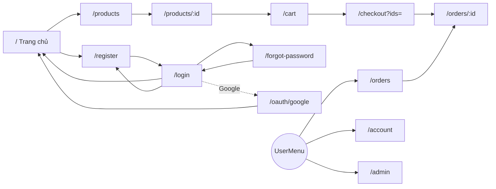
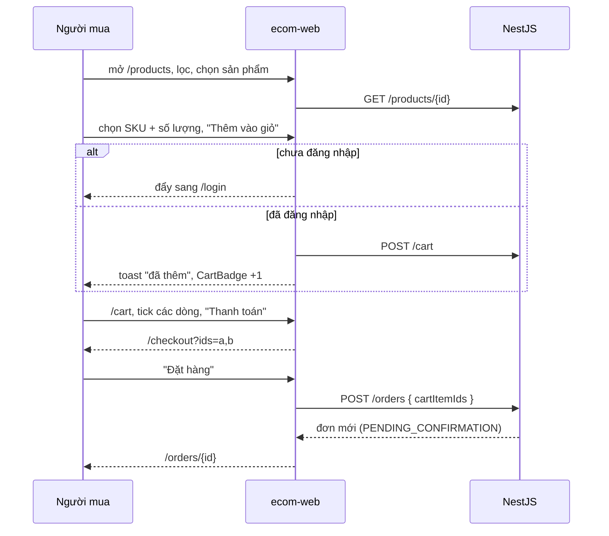
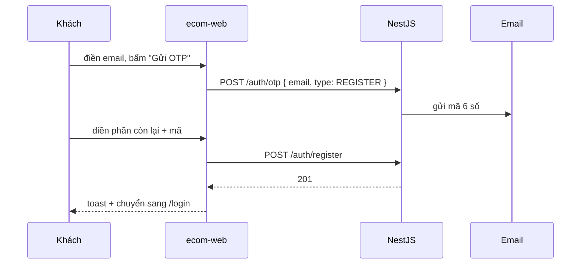
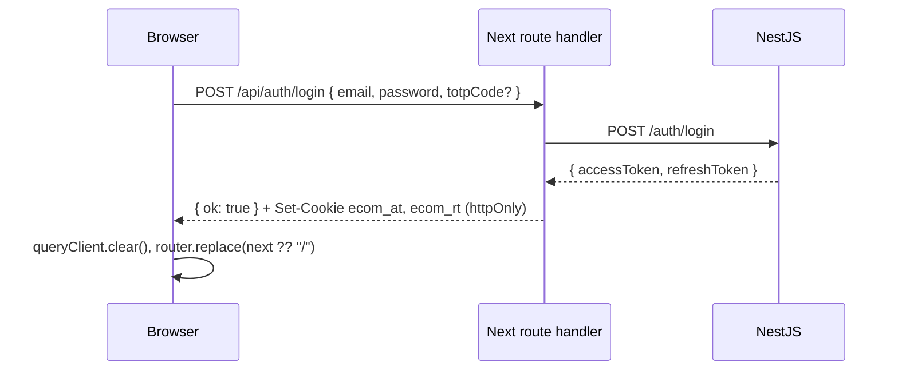
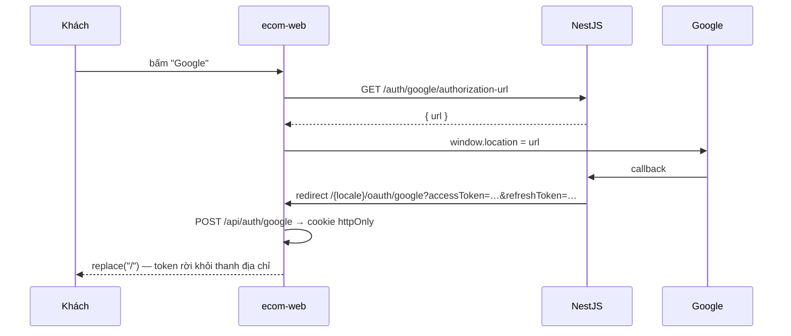
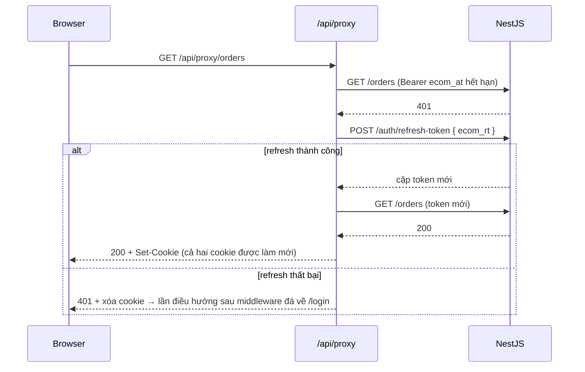
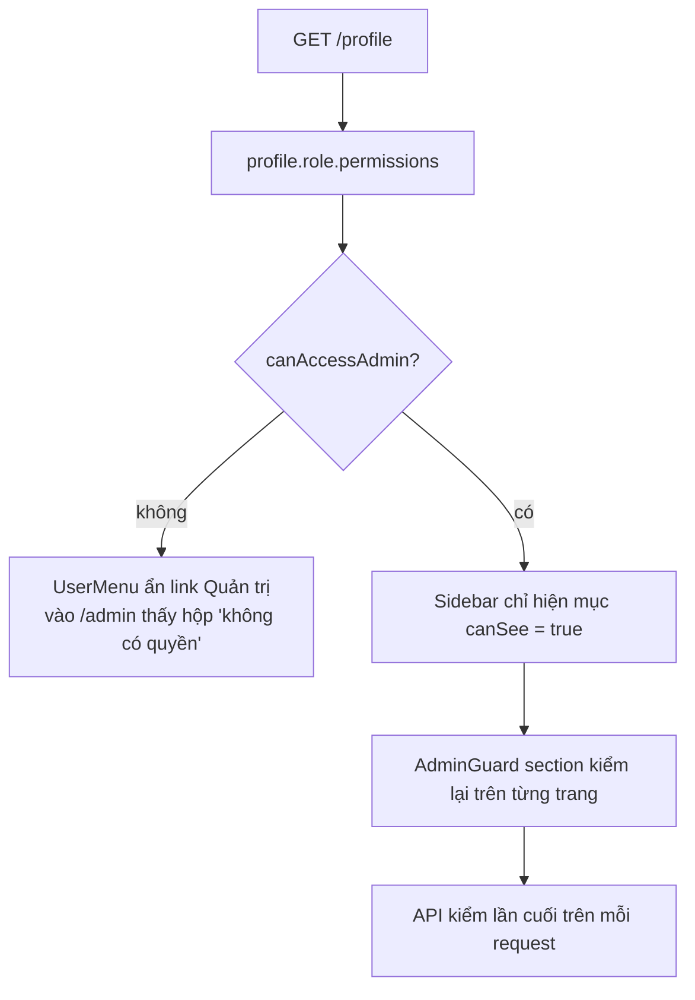

# 5. Luồng hoạt động

Phần này nối các màn lại với nhau. Đọc sau khi đã lướt qua mục 3 và 4.

## 5.1 Bản đồ điều hướng



Nét đứt = chuyển hướng tự động, không do người dùng bấm.

## 5.2 Mua hàng đầu-cuối



Điểm đáng nhớ:

- Món hàng **không** vào giỏ khi chưa đăng nhập — bấm là bị đẩy sang `/login`,
  và **không** có cơ chế nhớ lại món đang xem để thêm hộ sau khi đăng nhập.
- `checkout` không tự lấy cả giỏ; nó chỉ nhận đúng các id trên URL.
- Đặt hàng xong, `["cart"]` và `["orders"]` đều bị invalidate nên giỏ và danh
  sách đơn tự cập nhật.

## 5.3 Vòng đời đơn hàng

```
PENDING_CONFIRMATION ──► PENDING_PICKUP ──► PENDING_DELIVERY ──► DELIVERED
         │                      │                                    │
         └──── CANCELLED ◄──────┘                                RETURNED
```

| Ai | Làm được gì |
|---|---|
| Người mua | Hủy đơn, **chỉ khi** trạng thái là `PENDING_CONFIRMATION` hoặc `PENDING_PICKUP` (`PUT /orders/{id}/cancel`) |
| Quản trị | Đặt đơn sang **bất kỳ** trạng thái nào trong 6 giá trị, bằng select trên hàng (`PUT /manage-order/orders/{id}/status`) |

FE không ràng buộc thứ tự chuyển trạng thái — mọi quy tắc nằm ở backend.

## 5.4 Đăng ký (có OTP)



Đăng ký **không** tự đăng nhập. Nếu mã sai/hết hạn, backend trả `details[]` và
form tô đỏ đúng ô `code`.

Quên mật khẩu chạy y hệt, chỉ khác `type: FORGOT_PASSWORD` và endpoint cuối là
`POST /auth/forgot-password`.

## 5.5 Đăng nhập và nơi token dừng lại



Token dừng ở route handler. Browser chỉ biết "thành công hay không".
Nếu Nest trả về thiếu một trong hai token, handler trả 502 `MALFORMED_LOGIN_RESPONSE`.

**2FA**: tài khoản đã bật thì `POST /auth/login` sẽ trả lỗi nếu thiếu `totpCode`;
người dùng nhập mã 6 số từ app authenticator vào ô thứ ba rồi gửi lại.

## 5.6 Đăng nhập Google



Thất bại (Nest gắn `errorMessage`, hoặc thiếu token) → thẻ đỏ + nút về `/login`.

## 5.7 Access token hết hạn giữa chừng

Đây là luồng ít thấy nhất nhưng quan trọng nhất.



Chỉ thử refresh **một lần** cho mỗi request. Không có hàng đợi gom request —
nếu nhiều request cùng 401 một lúc thì mỗi cái tự refresh, và cái cuối cùng ghi
đè cookie.

## 5.8 Quyền quyết định người dùng thấy gì



Ba lớp, lớp cuối mới là lớp thật. Ẩn nút chỉ để người dùng không bấm vào thứ
chắc chắn trả 403.

## 5.9 Đổi ngôn ngữ

Bấm `LocaleSwitcher` → `router.replace(pathname, { locale })`. `pathname` từ
`@/i18n/navigation` đã bỏ prefix locale và giữ nguyên segment động, nên đang ở
`/vi/products/abc` sẽ sang đúng `/en/products/abc`.

Đổi ngôn ngữ kéo theo:

1. Chuỗi giao diện đổi file (`messages/en.json`).
2. Cookie `NEXT_LOCALE` đổi → proxy và `apiServer` gửi `x-lang` mới → thông báo
   lỗi từ backend cũng đổi ngôn ngữ.
3. Nội dung catalogue chọn lại bản dịch qua `pickTranslation` (`vi → vn`, thiếu
   thì `en`, thiếu nữa thì tên gốc).

## 5.10 Đăng xuất

`UserMenu` → `POST /api/auth/logout` → Nest thu hồi thiết bị → cookie bị xóa →
`queryClient.clear()` → toast → `replace("/")` + `refresh()`.

Nếu gọi Nest hỏng (mất mạng), cookie **vẫn** bị xóa: không để UI tiếp tục hiển
thị trạng thái đã đăng nhập trong khi phiên đã kết thúc về mặt ý định.
